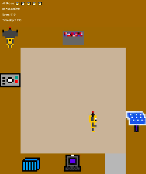
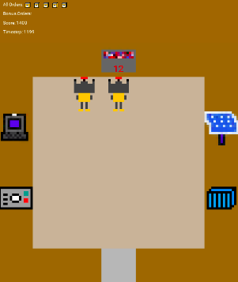
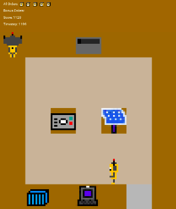
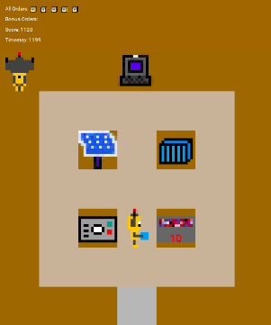
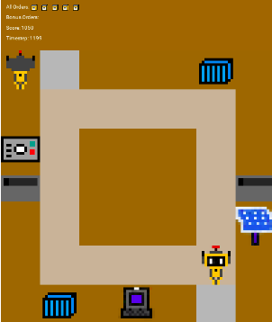
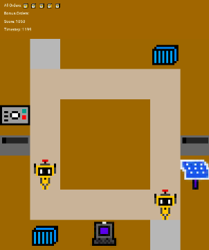
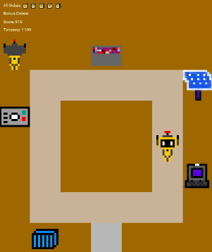
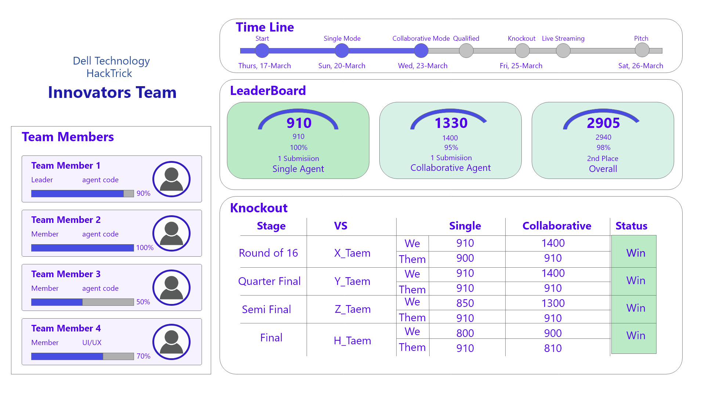

#### This Is the **Innovators** Team (**2nd Place Team**) Implementation For the Hackathon

**Team Members:**
* Islam Mesabah
* Ali Tarek
* Maher Mohamed
* Zyad Tahoon

**Scores:**


Board | Single Agent             |  Collaborative Agent
:-------------------------:|:-------------------------:|:-------------------------:
Leaderboard |   |  
Round of 16 |   |  
Quarter Final |   |  
Semi Final |   |  
Final |   |  


**UI/UX Track:**



# Hacktrick 2022

Welcome to Hacktrick!
In this hackathon, you will be required to implement agents that navigate through different layouts with
lab components scattered around the layout.
Your agents should be able to build four different types of labs, with each lab having different
requirements and specifications. We will be evaluating your agents based on the number of labs they
build in the allotted time. More in-depth technical details are provided in the following sections.
There will be two different types of agents and gameplay:

1. Single Mode: Only one agent collecting the components and building the labs.
2. Collaborative Mode: Two agents working together in the same layout to build the required labs.

Finally, it is worth noting that there are no constraints on how you implement these agents. We will be
providing you with tips on how to implement a reinforcement learning agent in this environment, but by
no means do we require you to submit an RL-based solution. You are free to implement your solutions
using any method you see fitting (Ex: rule-based agent).

We will be evaluating on **1200 timesteps**.

# Contents

- [Hacktrick 2022](#hacktrick-2022)
- [Contents](#contents)
- [Installation](#installation)
  - [Python Environment Setup](#python-environment-setup)
  - [Reinforcement Learning Setup](#reinforcement-learning-setup)
    - [PPO Tests](#ppo-tests)
    - [Rllib Tests](#rllib-tests)
- [Repo Structure Overview](#repo-structure-overview)
- [Implementation](#implementation)
  - [Agents](#agents)
  - [Visualizing Locally](#visualizing-locally)
  - [Submission](#submission)
- [Reinforcement Learning Modules Usage](#reinforcement-learning-modules-usage)

# Installation

When cloning the repository, make sure you also clone the submodules

```
$ git clone --recursive https://github.com/hacktrick-hackathon/hacktrick-hackathon-2022.git
```

## Python Environment Setup

Create a new python environment (this is optional) using any environment manager you want (we will use venv) and run the install script as before

```bash
$ python -m venv venv
$ source venv/bin/activate
(venv) $ ./install.sh
```

## Reinforcement Learning Setup

Install the latest stable version of tensorflow (if you don't have it) compatible with rllib.
Make sure to train using a gpu or use google colab. If you are not planning to use reinforcement learning or other machine learning methods, you do not need this.

```bash
(venv) $ pip install tensorflow
```

Your virtual environment should now be configured to run the rllib training code. Verify it by running the following command

```bash
(venv) $ python -c "from ray import rllib"
```

Note: if you ever get an import error, please first check if you activated the venv

### PPO Tests

```bash
(venv) $ cd hacktrick_rl/ppo
(venv) hacktrick_rl/ppo $ python ppo_rllib_test.py
```

### Rllib Tests

Tests rllib environments and models, as well as various utility functions. Does not actually test rllib training

```bash
(venv) $ cd rllib
(venv) rllib $ python tests.py
```

You should see all tests passing.

# Repo Structure Overview

`hacktrick_rl`

- `ppo/`:
  - `ppo_rllib.py`: Primary module where code for training a PPO agent resides. This is where you will implement your model architicture for a PPO agent
  - `ppo_rllib_client.py` Driver code for configuing and launching the training of an agent. More details about usage below
  - `ppo_rllib_test.py` Reproducibility tests for local sanity checks
- `rllib/`:
  - `rllib.py`: rllib agent and training utils that utilize Hacktrick APIs
  - `utils.py`: utils for the above
  - `tests.py`: preliminary tests for the above
- `utils.py`: utils for the repo

`hacktrick_ai`

- `mdp/`:

  - `hacktric_mdp.py`: main Hacktric game logic
  - `hacktric_env.py`: environment classes built on top of the Hacktric mdp
  - `layout_generator.py`: functions to generate random layouts programmatically
- `agents/`:

  - `agent.py`: location of agent classes
  - `benchmarking.py`: sample trajectories of agents (both trained and planners) and load various models
- `planning/`:

  - This directory contains some logic that might help you in implementing a rule-based agent.
  - You are free to disregard this directory and implement your own functions.
  - If you find any functions that make your implementation easier, or even as a guide/starter, feel free to use them.

# Implementation

## Agents

You should not need to play around in the `hacktrick_ai` dirctory as this is for the environment you will use. you implementation and submissions are disscussed below. The above is only added for completion.
In `hacktrick_agent.py` you will find two base classes `MainAgent()` and `OptionalAgent()`. Implement according to the following cases.

- In single mode, implement only the `MainAgent()` class and make sure your logic is correct for the `action()` method.
- In collaborative mode, implement both classes if you want to implement different agent logic and set `share_agent_logic` to `False`.
- In collaborative mode, implement `MainAgent()` only if you want to apply the same logic on both agents and set `share_agent_logic` to `True`.

## Visualizing Locally

Follow the steps in this notebook `hackathon_tutorial.ipynb`

Note:

- The `horizon` variable corresponds to the number of timesteps.
- Setting `num_games` to more than one will output the average score of these games. Feel free to adjust this parameter when testing, but we will be evaluating on one game only.

## Submission

- In `hacktrick_agent.py` you will find two base classes `MainAgent()` and `OptionalAgent()`. Implement your logic in these classes.
- Run this command `python3 client.py --team_name=TEAM_NAME --password=PASSWORD --mode=MODE --layout=LAYOUT_NAME`. Note that `mode` is either `single` or `collaborative`

# Reinforcement Learning Modules Usage

Before proceeding, it is important to note that there are two primary groups of hyperparameter defaults, `local` and `production`. Which is selected is controlled by the `RUN_ENV` environment variable, which defaults to `production`. In order to use local hyperparameters, run

```bash
$ export RUN_ENV=local
```

Your model architicture should go in the `ppo_rllib.py` file. You need to develop a PPO model utilizing the poilerblate code that you have to give you an idea about the inputs and outputs of the model. You do not need to worry about the training loop as this is handled by ray library in the background. Your only concern should be the model architicture and if you need to change the reward funciton check `get_dense_reward()` method in `rllib/`.
Training of agents is done through the `ppo_rllib_client.py` script. It has the following usage:

```bash
 ppo_rllib_client.py [with [<param_0>=<argument_0>] ... ]
```

For example, the following snippet trains a self play ppo agent on seed 1, 2, and 3, with learning rate `1e-3`, on the `"cramped_room"` layout for `5` iterations without using any gpus. The rest of the parameters are left to their defaults

```
(venv) ppo $ python ppo_rllib_client.py with seeds="[1, 2, 3] lr=1e-3 layout_name=cramped_room num_training_iters=5 num_gpus=0 experiment_name="my_agent"
```

For a complete list of all hyperparameters as well as their local and production defaults, refer to the `my_config` section of  `ppo_rllib_client.py`

Training results and checkpoints are stored in a directory called `~/ray_results/my_agent_<seed>_<timestamp>`. You can visualize the results using tensorboard

```bash
(venv) $ cd ~/ray_results
(venv) ray_results $ tensorboard --logdir .
```

The last command assumes you have installed tensorboard in a GUI-enabled environment for linux. If you are using WSL or colab you can easly figure out how to run tensorboard.
